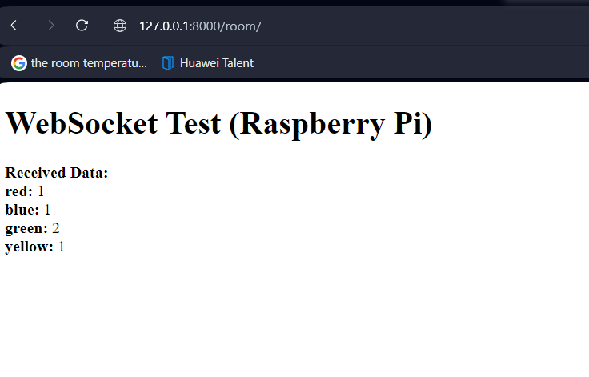

# COLORS

Select Random 4 letters and place an order

## Table of Contents

- [Installation](#installation)
- [Usage](#usage)
- [API Endpoint](#api-endpoint)

## Installation

To get started with the project, follow these steps:

1. ## Enter the Root folder directory of the project ;'project/'

2. ## Create a virtual environment (optional but recommended):
    ```python -m venv venv```
    ```source venv/bin/activate  # On Windows, use: venv\Scripts\activate```

3. ## Install project dependencies from the requirements.txt file:
    ```pip install -r requirements.txt```

3. ## Database migrations:
    ```python manage.py migrate```

4. ## Start the development server:
    ```python manage.py runserver```


## URLS

1. #### Home: http://127.0.0.1:8000/

2. #### Register: http://127.0.0.1:8000/register/

3. #### Login: http://127.0.0.1:8000/login/

4. #### Logout: http://127.0.0.1:8000/logout/

5. #### Raspberry Pi Websocket API: ws://127.0.0.1:8000/ws/raspberry_pi/
    ### For Testing:
    1. Naviage to the Endpoint: http://127.0.0.1:8000/room/
    2. Make and Order, You wil see the order you make will be display to the above Url( http://127.0.0.1:8000/room/)
    3. Below is a sample image for testing the websocket on a browser
        